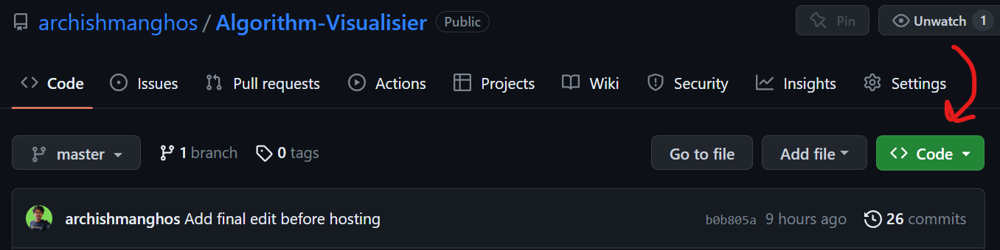
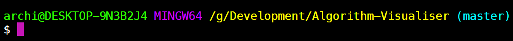

## How to run the application locally?

0. Check if Node js is installed on the system. This can be checked by running the command `node --version`. If it returns a version, it means Node has been installed, else install it from the [official site](https://nodejs.org/en).
1. The project on [Github](https://github.com/archishmanghos/Algorithm-Visualiser) will contain a `Code` button in green like below:

   

   

   

2. Click on the code button. There will be a download zip option.
3. Download and extract the files in the desired location.
4. Open the command prompt.
5. Get to the folder where the extracted files are stored.
6. cd to the Algorithm Visualiser directory. The final path should look something like this (the first folders may vary, the end should be like this):
   

   

   

7. Run the command `npm install` to install all the modules.
8. Run the command `npm run start` to start the web application locally.
